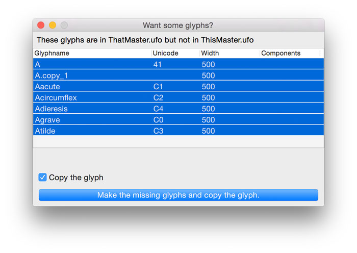

# Edit That Next Master
Script for RoboFont that makes switching glyph, space or font windows super easy.

# Switch between masters

If you're editing masters or whatever and you want to switch to the same glyph in the other master
and you spend a lot of time moving glyph windows around or you've had to divide your
massive pixel real estate into small lots.

Add these scripts to RF and wire them to a key command and then ⏩ or ⏪ cycle between the masters.

* *editThatNextMaster.py* wooshes one way.
* *editThatPreviousMaster.py* wooshes the other way.
* The script opens the window you're looking at, but for the next or previous font,
* Maintains window location and size.
* Between glyph windows it preserves zoom and scroll position.
* Between space windows it copies the preview text and preview font size.
* Between font windows it maintains glyph selection, current sort query and smart group selection.
* If glyphs are missing a window will list them and offer the possibility to make the glyphs.

# Add Glyphs Panel

This panel pops up when switching between masters and one or more glyphs are missing.

* If you don't want to add these glyphs, just close the window
* Perhaps this behaviour should be a preference
* Newly created glyphs get a copy of the other outline in the background.
* *If* the source glyph has components, *and* the width of the source glyph matches the width of the baseglyph, *then* the components are copied with the expected width.

# Show smartsets in SpaceCenter

* *seeThatNextSet.py* show the next smart set in the current SpaceCenter.
* *seeThatPreviousSet.py* show the previous smart set in the current SpaceCenter.
* If there is no smart set in the current SpaceCenter the script will pick the first one from the list.

The order in which these scripts woosh through the fonts: alphabetically sorted filepaths.

Notes
-----

* Does not work in single window mode because single window mode.
* Script windows, vanilla windows, preference window etc. are excluded from all the wooshing fun.
* RoboFont key commands can be added in the .py tab of the [Preferences window.](http://doc.robofont.com/documentation/workspace/preferences/python/) (link to RoboFont docs)
